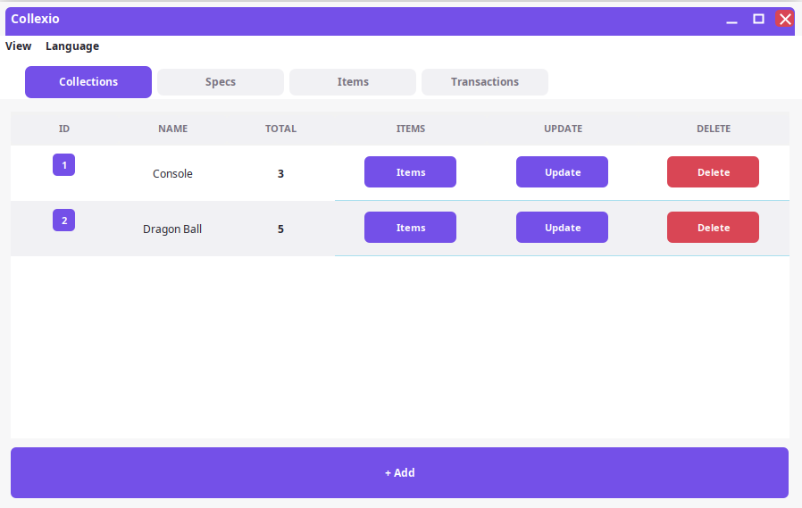
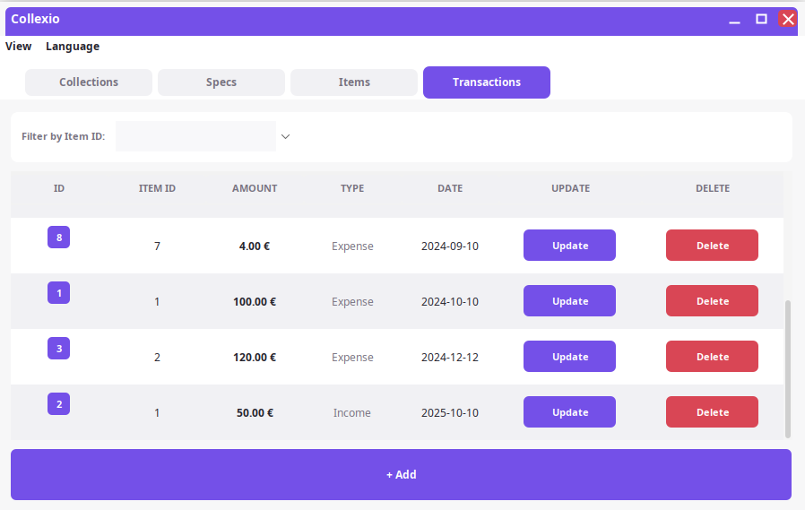
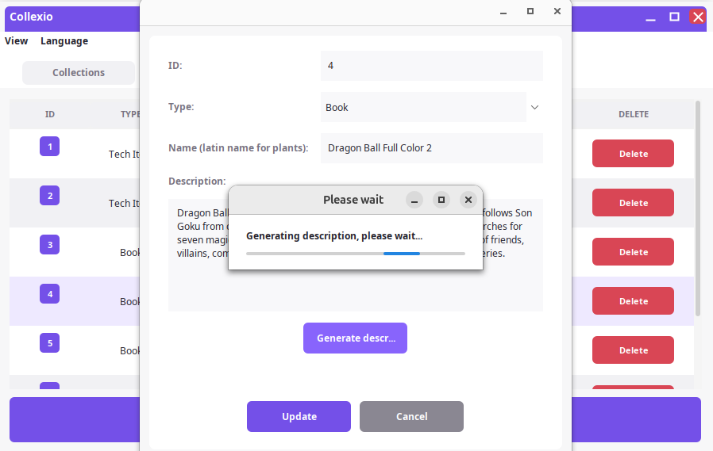
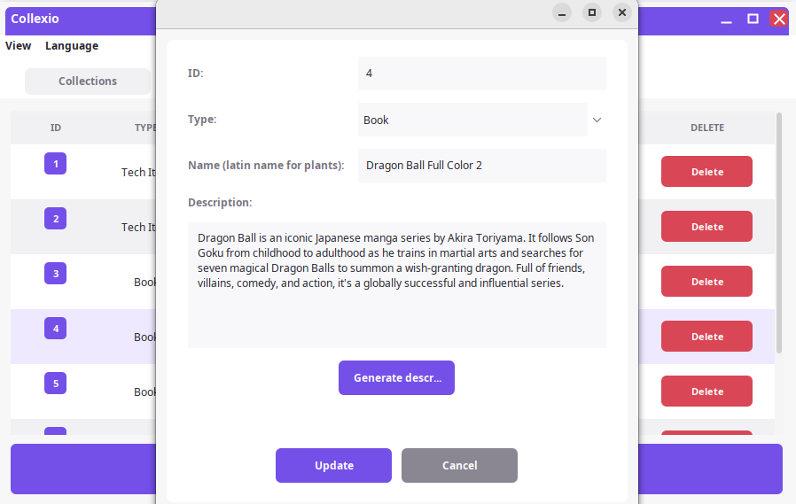
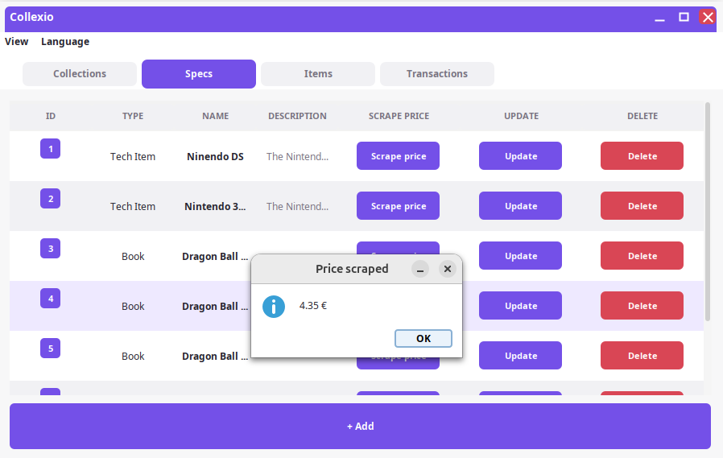
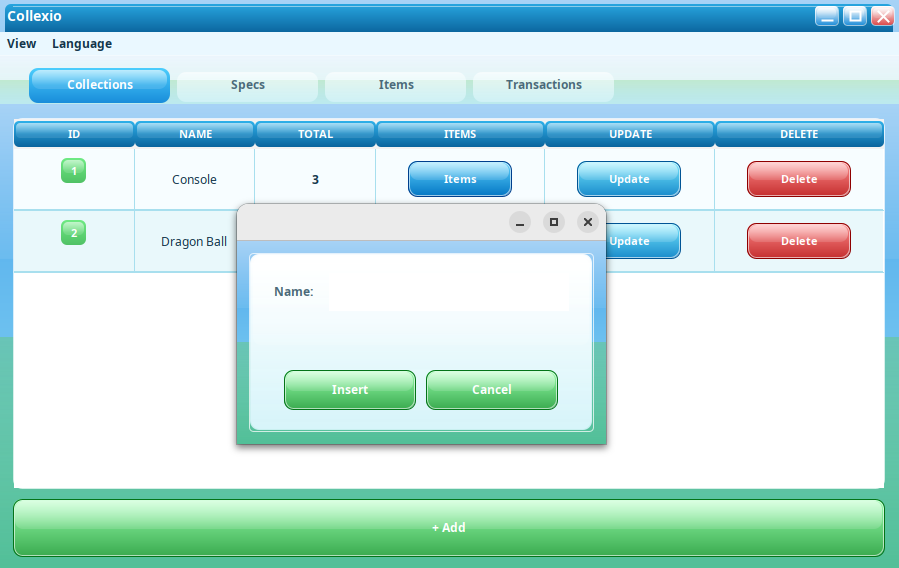
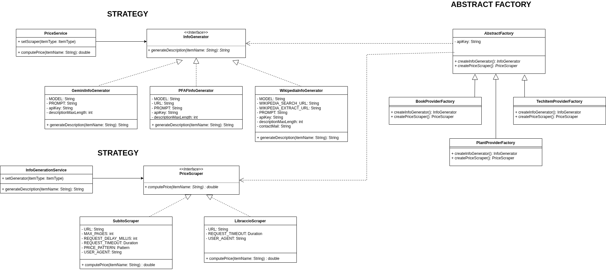

# Collexio

Collexio is a Java desktop application for managing personal collections.  
I built this project to practice vanilla Java, design patterns, and SOLID principles.

You can track your items (tech products, books, and plants) and organize them into collections.

The application distinguishes between:

- **Item specifications**: the generic description of an object (for example, *Nintendo DS*, *The Hobbit*, or *Ficus elastica*)
- **Items**: the concrete copies you own, each with its own status, photo, collection, and transactions

For example, if you own 4 Nintendo DS consoles, you create one item specification (*Nintendo DS*) and then add 4 separate items linked to it.

You can also track transactions associated with each item, such as purchase expenses and sales.  
Sold items remain visible inside the application and are highlighted in red, so they can still be tracked historically.

The app also supports:

- automatic used-price scraping from popular Italian marketplaces such as Libraccio and Subito.it (plants excluded)
- AI-generated item descriptions through Gemini integration, to avoid writing descriptions manually

## Screenshots

### Collection view


### Transaction view


### Description generation




### Price scraping


### Alternative theme: 2000 (Frutiger Aero)


## Architecture and Design
The architecture adopted is a layered architecture (persistence, business, and presentation), where the presentation layer uses the MVC pattern. Several design patterns are also used throughout the application.


## Terminology

- **Item specification**: the general object description, such as "Nintendo DS", "The Hobbit", or "Ficus elastica"
- **Item**: one concrete copy of an item specification, with its own status, photo, collection, and transactions
- **Collection**: a group of items
- **Transaction**: an income or expense associated with one item

## Requirements

- JDK 17 or newer
- Maven 3.8 or newer
- Linux with `jpackage` and Debian packaging tools to build the optional `.deb` package

## Installation

Collexio can be used in two different ways:

1. Installing the packaged release (`.deb`)
2. Running the application directly from source code

## Install From Release (Recommended)

Download the latest `.deb` release package and install it with:

```bash
sudo apt install ./collexio_1.0.0_amd64.deb
```

After installation, Collexio will be available:

- from your desktop application launcher
- through the `collexio` terminal command

Depending on your Linux distribution and desktop environment, the application is typically installed under:

```text
/opt/collexio/
```

### Desktop Shortcut

Most desktop environments automatically create an application launcher entry after installation.

If it does not appear immediately:

- log out and log back in
- or refresh the application menu cache

You can also manually create a desktop shortcut using the generated `.desktop` file usually located in:

```text
/usr/share/applications/collexio.desktop
```

## Run From Source Code

This method is intended for development purposes.

### Build The Project

```bash
mvn clean package
```

### Run The Application

```bash
java -jar target/collexio-1.0.0.jar
```

## First Launch

Collexio stores local application data inside:

```text
~/.collexio/
```

On the first launch, the application automatically creates:

```text
~/.collexio/data/collexio.db
~/.collexio/images/
~/.collexio/config.properties
```

The setup dialog asks for:

- a required contact email, used by scraping requests
- an optional Gemini API key, used only for AI-generated item descriptions

## Test

```bash
mvn test
```

## Release Build

To create a release build, use:

```bash
scripts/package-release.sh
```

The script:

- runs the Maven package lifecycle
- creates the `dist/` directory
- copies the executable jar
- generates a SHA-256 checksum
- builds a Debian package when `jpackage` is available

Expected outputs:

```text
dist/collexio-1.0.0.jar
dist/collexio-1.0.0.jar.sha256
dist/collexio_1.0.0_amd64.deb
```

## License

Apache 2.0